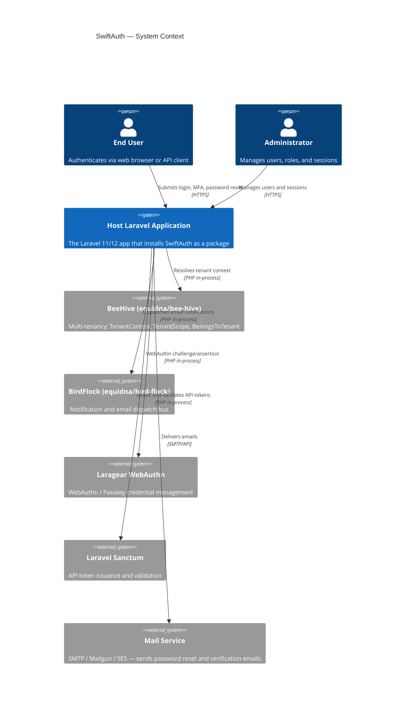
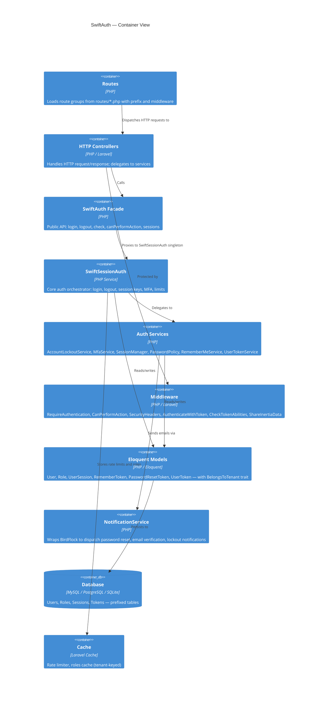
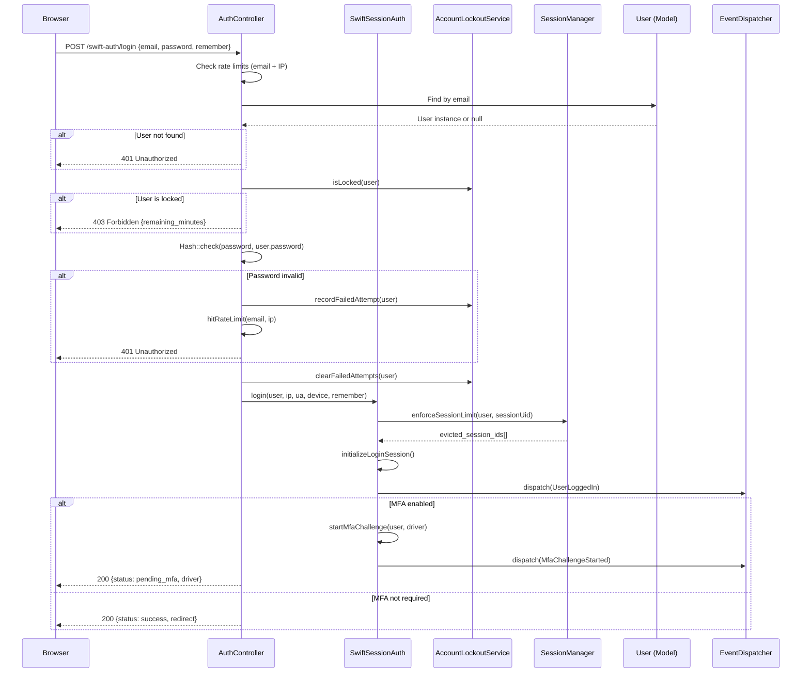
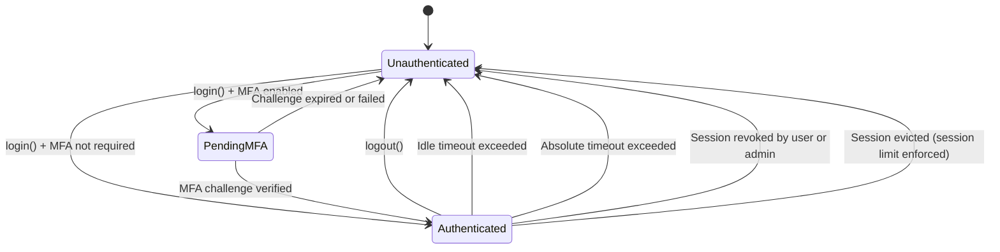
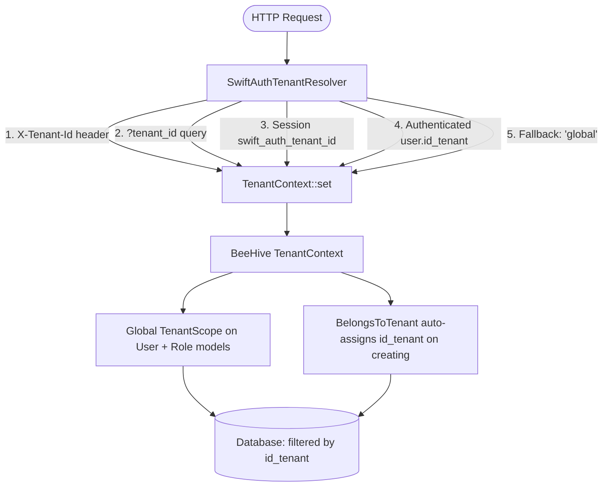

# Architecture Diagrams

> This document contains Mermaid diagrams describing the SwiftAuth system architecture at three levels of detail: System Context, Container, and Component.

---

## Level 1: System Context

Describes how SwiftAuth fits within a host Laravel application and its external interactions.

---

## Level 2: Container

Describes the internal packages and the Laravel application layer.

---

## Level 3: Component — Login Flow

Describes the detailed component interactions during a login request.

---

## Level 3: Component — Session Lifecycle

---

## Level 3: Component — Multi-Tenancy

---

## Key Design Decisions

| Decision                          | Rationale                                                                                    |
| --------------------------------- | -------------------------------------------------------------------------------------------- |
| Single Facade (`SwiftAuth`)       | Provides a stable, discoverable public API without exposing internals                        |
| `SwiftSessionAuth` as singleton   | Reuses session/request state within a single request lifecycle                               |
| `BelongsToTenant` via BeeHive     | Tenant isolation is enforced at the Eloquent layer, not in controllers                       |
| Config-driven table/route prefix  | Avoids naming collisions in host apps with existing tables or routes                         |
| `SelectiveRender` trait           | Keeps controllers frontend-agnostic; supports Blade and Inertia equally                      |
| SHA-256 tokens (not encrypted)    | Reset and verification tokens stored as `hash('sha256', $raw)` — fast, one-way, no IV needed |
| Events for all auth state changes | Allows host apps to react to login, logout, eviction, and MFA events                         |
